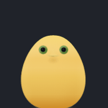

# 奶蛋 / Naidan

> **English** — Naidan is a tiny egg-shaped desktop pet for Windows & macOS, built with
> Electron + HTML5 Canvas. Click it and it blinks, squashes and bounces with a springy
> "duang" sound; its pupils follow your mouse **anywhere on screen**; you can drag it
> around, and it idles by breathing, blinking, looking around, wobbling and hopping.
> No external assets besides one CC0 sound — all animation and rendering is hand-written.

奶蛋是一只鹅黄色的蛋形桌面小生物。点一下,它会眨眼、Q 弹一下、发出「duang~」的声音;
鼠标在**整个屏幕**上移动时,它的瞳孔会一直跟着你;按住可以把它拎起来拖走;
闲着的时候它会呼吸、眨眼、东张西望、摇晃、小跳。



---

## 功能

| 功能 | 说明 |
|---|---|
| **点击反应** | 眨眼 + 3~4 次衰减果冻形变 + 4 声「duang」,与弹簧极点对齐 |
| **Q 弹物理** | 阻尼弹簧驱动,缩放锚点固定在**蛋体底部中心**,不会飘 |
| **音效** | 外部素材 [Bubble_4](audio/bubble_4.mp3)(Freesound,CC0);`playbackRate` 调音高,±3% 随机扰动,5ms 淡入 / 30ms 淡出 |
| **眼睛全局跟随** | 主进程轮询光标(动 60Hz / 静止 10Hz / 窗口隐藏时停止),瞳孔朝鼠标转,五官整体偏移最多 2px |
| **待机动作** | 呼吸(常驻)、自然眨眼(含连眨)、左右张望、不倒翁式摇摆、小跳、打哈欠式拉伸;3~8 秒随机一个,不连续重复 |
| **拖拽** | 被「拎起」并轻微拉长,松手落地回弹(幅度约为点击的一半) |
| **形变限幅** | `clampDeformation()` 保证任何极端形变下头顶都不会被画布裁平 |
| **右键菜单** | 静音 / 窗口置顶 / 开机自启 / **大小**(0.75 · 1.0 · 1.5)/ 眼睛跟随鼠标 / 隐藏 / 退出 |
| **托盘图标** | 显示 / 隐藏、调大小、静音、置顶、自启、退出 —— 桌宠被拖出屏幕也能找回来 |
| **快捷方式** | 安装包自动建桌面 + 开始菜单快捷方式;便携版有一键脚本 |
| **窗口** | 128 × 170(默认),透明、无边框、置顶、不进任务栏、不抢键盘焦点;蛋体以外区域鼠标穿透 |
| **记忆** | 尺寸、音量、位置、窗口置顶、眼睛跟随开关都会记住 |

---

## 运行

```bash
npm install        # 首次会下载 Electron 运行时(约 100MB)
npm start          # 启动奶蛋
npm run selftest   # 71 项行为自测(用本机 Chrome/Edge 无头跑)
```

也可以直接双击项目里的 **`启动奶蛋.bat`**。

## 打包

```bash
npm run dist       # 当前系统打包(Windows 出 NSIS 安装包 + 便携版)
npm run dist:win   # 指定 Windows x64
npm run build      # 等价于 electron-builder,按 package.json 配置出全部目标
npm run dist:dir   # 只输出未打包目录,调试用,速度快
```

产物在 `dist/`:

| 平台 | 文件 |
|---|---|
| Windows | `奶蛋-Setup-1.0.0.exe`(NSIS 安装包,自动建快捷方式)、`奶蛋-Portable-1.0.0.exe`(免安装) |
| macOS | `奶蛋-1.0.0-<arch>.dmg`、`.zip`(需在 macOS 上打包) |

便携版想补桌面快捷方式:

```powershell
tools\create-shortcut.bat
# 或
powershell -ExecutionPolicy Bypass -File tools\create-shortcut.ps1 -ExePath "D:\apps\奶蛋.exe"
```

### 自动发布

`.github/workflows/release.yml` —— 推送 `v*` 标签时自动构建 Windows 安装包 + 便携版
(以及可选的 macOS 包)并上传到 GitHub Release。**不包含任何密钥**,用的是 Actions 自带的
`GITHUB_TOKEN`。

---

## 配置

**所有可调参数都在 `src/renderer/js/config.js` 一个文件里。**

| 想改什么 | 位置 |
|---|---|
| 窗口尺寸 / 蛋体大小 / 画布留白 | `window.*`、`layout.*` |
| 全局缩放(小 0.75 / 默认 1.0 / 大 1.5) | `appearance.scale`、`appearance.presets` |
| 蛋形曲线(胖瘦、上窄下宽) | `eggCurve.p` / `eggCurve.q` |
| 所有颜色 | `colors.*`(含 `bodyGradient`、`scleraGradient`、`billGradient`、`lighting`) |
| 五官位置与大小 | `features.eye` / `features.bill` / `features.bridge` |
| 弹簧手感 | `motion.jelly.*`:`frequencyHz`(弹跳快慢)、`dampingRatio`(阻尼)、`clickSquash`(压缩量,0.15 → scaleY 0.85)、`volumeRatio`(横向拉伸);也可直接写 `stiffness` / `damping` |
| 形变上限 | `motion.limits.*`:maxScaleY 1.08 / 拎起 ≤6px / 小跳 ≤10px |
| 眨眼时长与频率 | `motion.blink.*` |
| 待机动作间隔与动作池 | `motion.idle.minGapSec / maxGapSec / pool` |
| 眼睛跟随 | `motion.eyeFollow.*`:maxOffsetRatio 0.35、lerp 0.15、idleResetSec 5 |
| 音效 | `audio.*`:素材路径、音高序列、音量序列、淡入淡出、并发上限、轻动作 |
| 性能 | `perf.activeFps` / `perf.calmFps`(调成 30 可再省一半 CPU) |

**换音效**:把 wav/mp3 放进 `audio/`,或改 `audio.file`。代码按
`bubble_4.mp3 → .wav → .ogg` 顺序自动找。

---

## 目录结构

```
naidan-desktop-pet/
├── src/
│   ├── main/            Electron 主进程(透明窗口 / 托盘 / 原生菜单 / 单实例 / 自启 / 光标轮询)
│   │   ├── main.js
│   │   └── preload.js   contextBridge 最小权限桥
│   └── renderer/
│       ├── index.html
│       ├── styles.css
│       └── js/
│           ├── config.js    ★ 唯一需要改的配置文件
│           ├── egg.js       蛋形解析曲线 + 命中判定
│           ├── creature.js  状态机 + 弹簧物理 + Canvas 绘制
│           ├── audio.js     素材播放 + 音高/音量包络
│           └── app.js       输入、rAF 主循环、IPC
├── assets/              (原创意资源;图标在 build/)
├── config/              (预留:外部配置覆盖)
├── build/               icon.ico(16/32/48/64/128/256)、icon.icns、icon.png、tray.png
├── docs/                程序自绘的预览图与自测图
├── audio/               音效素材(Bubble_4,CC0)
├── tools/
│   ├── selftest.html / run-selftest.js    71 项行为自测
│   ├── preview.html                       静态渲染 / 图标 / 动画连环图
│   └── create-shortcut.ps1 / .bat         便携版桌面快捷方式
├── .github/workflows/release.yml
├── LICENSE              MIT(只覆盖代码,不覆盖角色形象)
└── CREDITS.md           第三方组件与素材来源
```

---

## 常见问题

**Q: 点击没反应?**
只有蛋体本身接收鼠标事件,透明区域是穿透的。另外如果蛋体被其他置顶窗口盖住也会点不到。

**Q: 桌宠太小 / 太大?**
右键蛋体 →「大小」→ 小(0.75)/ 默认(1.0)/ 大(1.5),选择会记住。

**Q: 拖到屏幕外找不到了?**
右键托盘图标 →「显示奶蛋」,显示时会自动夹回可见区域。

**Q: 想彻底关掉?**
右键蛋体 → 退出,或托盘右键 → 退出。都会销毁托盘与窗口、关闭 AudioContext,
任务管理器里不留进程。

**Q: 眼睛不跟着鼠标了?**
右键菜单里的「眼睛跟随鼠标」可能被关掉了;另外窗口隐藏或最小化时会停止轮询(省 CPU)。

**Q: 想换图标?**
替换 `build/icon-1024.png` 后用 `tools/preview.html?mode=icon` 重新渲染,
或直接替换 `icon.ico` / `icon.icns` / `tray.png`。

---

## 已知限制

1. **角色形象非商用** —— 见下方「形象说明」。
2. **音效是外部素材** —— `audio/bubble_4.mp3`(CC0),不是代码合成;想纯合成需要自己实现。
3. **形变的极端组合**做过限幅验证(拖拽/甩动/点击回弹/小跳四种极限位姿头顶都不越界),
   但没做过逐帧录屏回归。
4. **macOS 未实机验证** —— 打包配置与 `app.setLoginItemSettings` 已就绪,
   但只在 Windows 上做过运行与截图自测。
5. **开机自启在开发模式下**会把 `electron.exe` + 项目路径写进注册表;打包后才是正式 exe。
   默认关闭,由右键菜单开关。
6. 未做「吸附到其他窗口」「多显示器跟随」之类的高级行为,只做了「至少保留 60px 可见」的兜底。

---

## 形象说明

奶蛋(Naidan)的形象**参考自网络图片**,仅用于**学习交流**,
**不作商业用途**。如果权利人认为不妥,请提 issue 或联系作者,会立即删除相关资源。

`LICENSE` 中的 MIT 条款**只覆盖本仓库的源代码、构建脚本与文档,不覆盖角色形象本身**。

---

## 许可

代码:[MIT](LICENSE) · 第三方组件与素材:[CREDITS.md](CREDITS.md)
